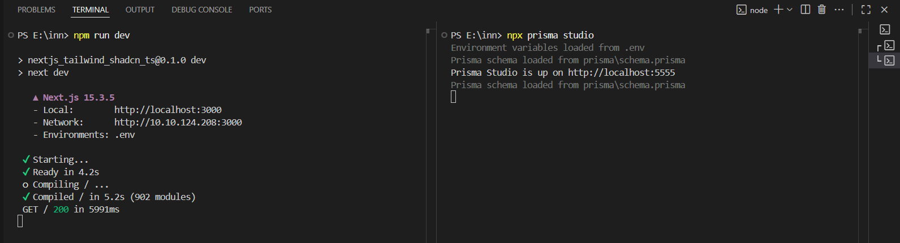
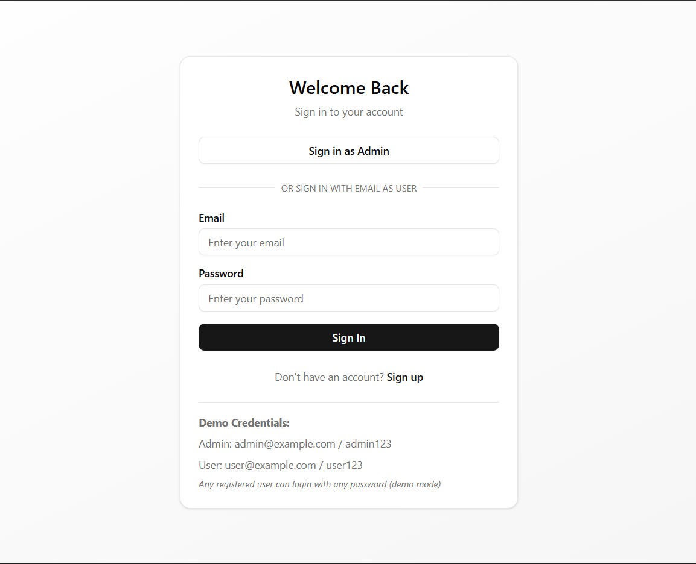
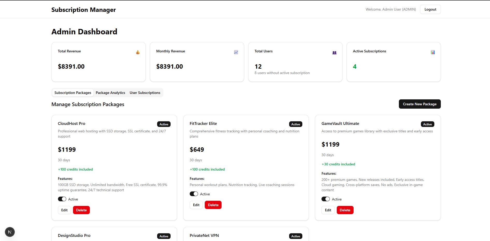
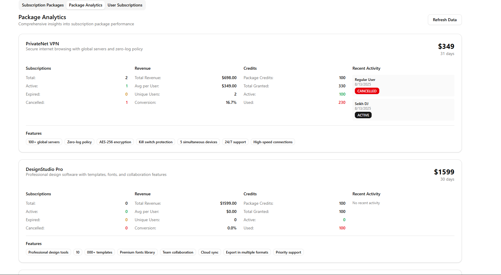
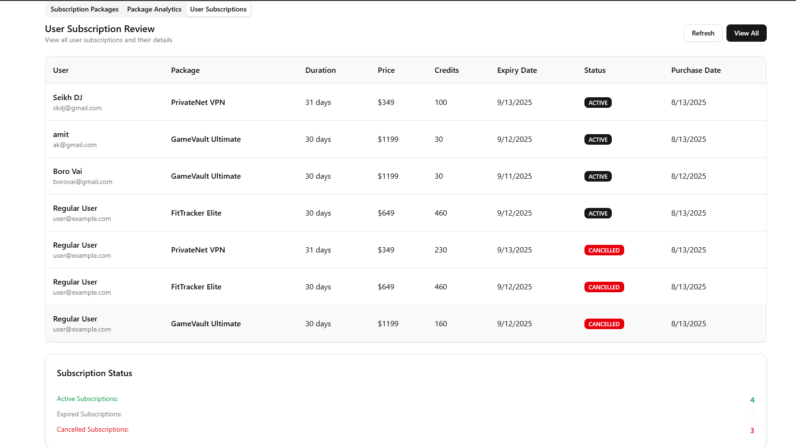
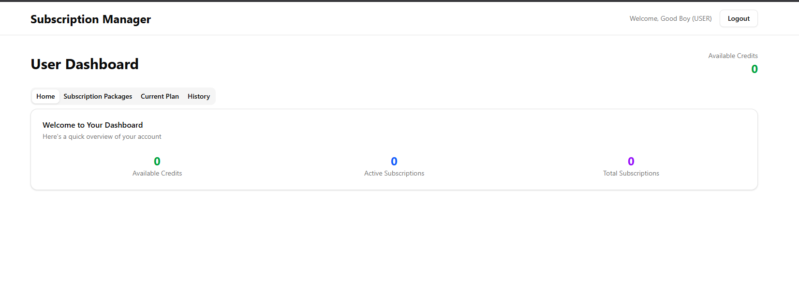

🚀 Welcome to Subscription System
A modern, production-ready web application scaffold powered by cutting-edge technologies, designed and developed by Abir Kundu.

✨ Technology Stack
This scaffold provides a robust foundation built with:

## 🎯 Core Framework
⚡ Next.js 15 - The React framework for production with App Router

📘 TypeScript 5 - Type-safe JavaScript for better developer experience

🎨 Tailwind CSS 4 - Utility-first CSS framework for rapid UI development

## UI Components & Styling
🧩 shadcn/ui - High-quality, accessible components built on Radix UI

🎯 Lucide React - Beautiful & consistent icon library

🌈 Framer Motion - Production-ready motion library for React

🎨 Next Themes - Perfect dark mode in 2 lines of code

## 📋 Forms & Validation
🎣 React Hook Form - Performant forms with easy validation

✅ Zod - TypeScript-first schema validation

## 🔄 State Management & Data Fetching
🐻 Zustand - Simple, scalable state management

🔄 TanStack Query - Powerful data synchronization for React

🌐 Axios - Promise-based HTTP client

## 🗄️ Database & Backend
🗄️ Prisma - Next-generation Node.js and TypeScript ORM

🔐 NextAuth.js - Complete open-source authentication solution

## 🎨 Advanced UI Features
📊 TanStack Table - Headless UI for building tables and datagrids

🖱️ DND Kit - Modern drag and drop toolkit for React

📊 Recharts - Redefined chart library built with React and D3

🖼️ Sharp - High performance image processing

## 🌍 Internationalization & Utilities
🌍 Next Intl - Internationalization library for Next.js

📅 Date-fns - Modern JavaScript date utility library

🪝 ReactUse - Collection of essential React hooks for modern development

## 🎯 Why This Scaffold?
🏎️ Fast Development - Pre-configured tooling and best practices

🎨 Beautiful UI - Complete shadcn/ui component library with advanced interactions

🔒 Type Safety - Full TypeScript configuration with Zod validation

📱 Responsive - Mobile-first design principles with smooth animations

🗄️ Database Ready - Prisma ORM configured for rapid backend development

🔐 Auth Included - NextAuth.js for secure authentication flows

📊 Data Visualization - Charts, tables, and drag-and-drop functionality

🌍 i18n Ready - Multi-language support with Next Intl

🚀 Production Ready - Optimized build and deployment settings

## 🚀 Quick Start
bash
Copy code
# Install dependencies
npm install

# Start development server
npm run dev

# Build for production
npm run build

# Start production server
npm start
Open http://localhost:3000 to see your application running.

📁 Project Structure
bash
Copy code
src/
├── app/                 # Next.js App Router pages
├── components/          # Reusable React components
│   └── ui/              # shadcn/ui components
├── hooks/               # Custom React hooks
└── lib/                 # Utility functions and configurations
🎨 Available Features & Components
This scaffold includes a comprehensive set of modern web development tools:

<video controls src="20250813-0927-18.4765571.mp4" title="User Purchased Package"></video>
<video controls src="20250813-0928-12.6556094.mp4" title="User Switched to Another Package"></video>

## 🗄️ Prisma Database Commands
If you want to view or manage the database for Subscription System, here are the most useful Prisma commands to run in your VS Code terminal (from the project root):

## Purpose	Command
Open Prisma Studio (GUI to browse & edit DB)	npx prisma studio
Apply schema changes to DB & regenerate client	npx prisma migrate dev --name <migration_name>
Regenerate Prisma client manually	npx prisma generate
Deploy migrations to production	npx prisma migrate deploy

Example:

bash
Copy code
# View database in Prisma Studio
npx prisma studio

# Create migration after editing schema
npx prisma migrate dev --name added_user_table
Prisma Studio will open in your browser at http://localhost:5555, letting you see and edit your database tables directly.

## 🧩 UI Components (shadcn/ui)
Layout: Card, Separator, Aspect Ratio, Resizable Panels

Forms: Input, Textarea, Select, Checkbox, Radio Group, Switch

Feedback: Alert, Toast (Sonner), Progress, Skeleton

Navigation: Breadcrumb, Menubar, Navigation Menu, Pagination

Overlay: Dialog, Sheet, Popover, Tooltip, Hover Card

Data Display: Badge, Avatar, Calendar

## 📊 Advanced Data Features
Tables: Powerful data tables with sorting, filtering, pagination (TanStack Table)

Charts: Beautiful visualizations with Recharts

Forms: Type-safe forms with React Hook Form + Zod validation

## 🎨 Interactive Features
Animations: Smooth micro-interactions with Framer Motion

Drag & Drop: Modern drag-and-drop functionality with DND Kit

Theme Switching: Built-in dark/light mode support

## 🔐 Backend Integration
Authentication: Ready-to-use auth flows with NextAuth.js

Database: Type-safe database operations with Prisma

API Client: HTTP requests with Axios + TanStack Query

State Management: Simple and scalable with Zustand

## 🌍 Production Features
Internationalization: Multi-language support with Next Intl

Image Optimization: Automatic image processing with Sharp

Type Safety: End-to-end TypeScript with Zod validation

Essential Hooks: 100+ useful React hooks with ReactUse for common patterns

Built with ❤️ by Abir Kundu for the Subscription System project 🚀
